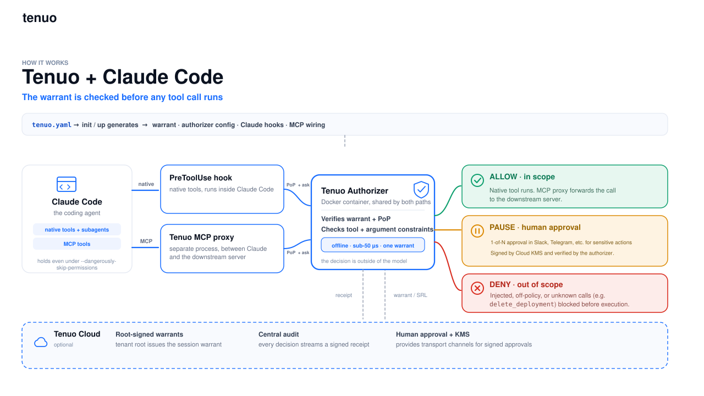
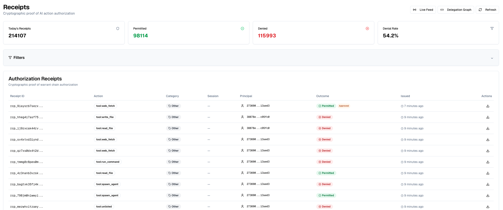

# Tenuo for Claude Code

PyPI package: [`tenuo-claude-code`](https://pypi.org/project/tenuo-claude-code/) · CLI: `tenuo-claude`, `tenuo-admin`

[](https://pypi.org/project/tenuo-claude-code/)
[](https://pypi.org/project/tenuo-claude-code/)
[](https://github.com/tenuo-ai/claude-governance/actions/workflows/ci.yml)
[](LICENSE)

**Keep your AI coding agent inside the lines.** Tenuo enforces a signed, least-privilege
warrant on every tool call Claude Code makes, so it cannot read files outside its sandbox,
run shell commands beyond an allowlist, or reach off-policy domains, even when the model is
jailbroken or running `--dangerously-skip-permissions`. Every call is checked with a
PoP-signed authorization request; audit receipts are signed and retained in
[Tenuo Cloud](https://cloud.tenuo.ai) when connected.

[Tenuo](https://tenuo.ai) governance for [Claude Code](https://code.claude.com/docs):
every agent tool call is checked against a signed warrant (hook → authorizer),
with a decision log on each call, including under `--dangerously-skip-permissions`.

**Install:** `pip install tenuo-claude-code` (CLI commands `tenuo-claude` and `tenuo-admin`).

## How it works



```
tenuo.yaml  →  init/up  →  warrant + authorizer + hooks + MCP proxy
                                    |
                                    |
                                    v
              native tools (PreToolUse hook)  |  MCP tools (proxy)
                                    |
                                    |
                                    v
                         authorizer → allow / deny → log / receipt
```

Claude hits the MCP proxy (not your downstream server) and the PreToolUse hook for
native tools. Both paths use the same warrant and authorizer.

More: [docs/DETAILS.md](docs/DETAILS.md)

## Prerequisites

- Python ≥ 3.10
- **Authorizer runtime** — one of:
  - **Native (recommended when Docker is unavailable):** install the published
    [`tenuo-authorizer`](https://crates.io/crates/tenuo) binary (same version as the
    pinned Docker image, currently `0.1.0-beta.24`):

    ```bash
    cargo install tenuo --version 0.1.0-beta.24 \
      --features data-plane,server --bin tenuo-authorizer --locked
    ```

    Ensure `~/.cargo/bin` is on your `PATH`, then `tenuo-claude up --native` (or rely
    on auto-fallback when Docker is not running). Override with `TENUO_AUTHORIZER_BIN`
    if needed. The CLI checks that the binary matches the package pin; set
    `TENUO_AUTHORIZER_SKIP_VERSION=1` only for local dev against a different build.
  - **Docker:** the pinned `tenuo/authorizer` container (`tenuo-claude up --docker`, or
    default when Docker is available). Holder keys and PoP signing stay on the host; only
    `gateway.yaml` is mounted into the container.
- [Claude Code](https://code.claude.com/docs) — for live agent use, not for a first eval
  (see [Quick eval](#quick-eval-no-claude) below)

**Local mode:** no Tenuo Cloud account; good for one project or evaluation.

**Cloud mode:** [cloud.tenuo.ai](https://cloud.tenuo.ai) tenant for tenant-root
warrants, central audit, fleet revocation, and org-wide rollout ([Cloud mode](#cloud-mode)).

| If you want to… | Start here |
|-----------------|------------|
| Install and run on your machine | [Use the tool (PyPI)](#use-the-tool-pypi) |
| Clone, hack, or run the sample project | [Build from source](#build-from-source) |
| Review security posture | [Security](#security) |
| Plan org-wide rollout (managed settings, Cloud) | [Talk to us](https://tenuo.ai/early-access.html) |
| Implementation depth | [docs/DETAILS.md](docs/DETAILS.md) |

---

## Use the tool (PyPI)

Five steps. All commands run in **one project directory** that contains `tenuo.yaml`.

**1. Install**

```bash
pip install tenuo-claude-code
```

**2. Create a project folder**

```bash
mkdir my-project && cd my-project
mkdir workspace    # sandbox: files Claude may read per policy
```

**3. Add policy**: save as `tenuo.yaml` in this folder:

```yaml
name: my-project
sandbox: ./workspace
mode: enforce
enforce:
  Read: "subpath:{sandbox}"
  Bash: "shlex:ls,pwd,echo,date"
default: deny
```

Or fetch the example policy:

```bash
curl -fsSL https://raw.githubusercontent.com/tenuo-ai/claude-governance/main/tenuo.yaml.example -o tenuo.yaml
```

**4. Initialize and start**: pick one:

```bash
# Manual
tenuo-claude init      # warrant + Claude hooks + MCP wiring
tenuo-claude up        # authorizer in Docker: expect "Local mode (no Cloud)"
tenuo-claude verify    # confirm policy matches authorizer
```

```bash
# Or wizard (same end state; runs check + init + up + verify)
tenuo-claude onboard --local
```

**5. Use Claude Code**

Open Claude Code **in `my-project/`** (same directory as `tenuo.yaml`).

### Quick eval (no Claude)

To prove policy enforcement without installing Claude Code:

```bash
pip install tenuo-claude-code
# … create my-project/ with tenuo.yaml (steps 2–3 above)
tenuo-claude onboard --local    # needs Docker; runs check → init → up → verify
```

`verify` exercises allow/deny against the live authorizer (out-of-scope reads, shell
chaining, default-deny). Or run the [reference demo](demo/) tour: `tenuo-claude demo`.

### Day to day

| When | Command |
|------|---------|
| Start work (authorizer down or warrant expired) | `tenuo-claude up` |
| You edited `tenuo.yaml` | `tenuo-claude refresh` |
| Something broken | `tenuo-claude check` |
| See decisions | `tenuo-claude audit` |
| Stop authorizer | `tenuo-claude down` |

Generated files (do not commit): `.state/` (keys, warrant), `.claude/settings.json` (hooks).

### All commands

| Command | Does |
|---------|------|
| `init` | Mint warrant, wire hooks and `.mcp.json` |
| `up` / `down` | Start / stop authorizer |
| `refresh` | Re-apply `tenuo.yaml` (restarts authorizer if up) |
| `check` | Preflight: deps, credentials, wiring drift |
| `verify [--deep]` | Policy self-test against the authorizer |
| `status` | Warrant, posture, Cloud summary |
| `onboard` | Interactive local or Cloud setup wizard |
| `bench [--json]` | Per-tool-call overhead |
| `audit [--tail N]` | Receipt trail |
| `revoke` | Revoke session warrant |

See also: [Policy](#policy-tenuoyaml) · [Cloud mode](#cloud-mode) · [docs/DETAILS.md](docs/DETAILS.md)

---

## Build from source

For hacking on the CLI, running the reference demo from git, or using `./bin/tenuo-claude`
instead of a PyPI install.

```bash
git clone https://github.com/tenuo-ai/claude-governance.git
cd claude-governance

uv venv && uv sync && chmod +x bin/tenuo-claude
source .venv/bin/activate   # Windows: .venv\Scripts\activate
```

Run commands via the repo launcher or editable install:

```bash
./bin/tenuo-claude --help
# or: uv run tenuo-claude --help
# or: pip install -e . && tenuo-claude --help
```

**Reference demo** (sample policy and sandbox):

```bash
cd demo
tenuo-claude bootstrap          # check → init → up → verify (local by default)
tenuo-claude demo                # optional scripted tour
```

Open Claude Code in `demo/`. See [demo/README.md](demo/README.md).

Re-run `tenuo-claude init` or `refresh` after switching Python venvs: hooks pin
`sys.executable` in `.claude/settings.json`.

Contributors: [CONTRIBUTING.md](CONTRIBUTING.md).

---

## Policy (`tenuo.yaml`)

One file drives the warrant, authorizer routes, hooks, and MCP proxy. The [minimal example](#use-the-tool-pypi) is enough to start; expand as needed:

```yaml
name: my-project
sandbox: ./workspace
mode: enforce
enforce:
  Read:  "subpath:{sandbox}"
  Bash:  "shlex:ls,pwd,echo,date"
  WebFetch:
    domains: ["api.github.com", "*.githubusercontent.com"]
default: deny
subagents:
  analyst:
    tools: [Read, Grep, Glob]
mcp:
  downstream: ./your_mcp_server.py
  enforce:
    read_file: "subpath:{sandbox}"
```

- `enforce`: allowed and argument-checked.
- `audit`: harness tools from bundled list (extend with `audit_extra:`).
- `default: deny`: everything else blocked with a receipt.
- `mode: audit`: receipt allow/deny without blocking (rollout).
- `subagents:`: [DETAILS.md](docs/DETAILS.md#subagents).

**Policy templates:** ready-made patterns in [examples/policies/](examples/policies/).
Download one, save as `tenuo.yaml` in your project directory, adapt sandbox paths
and tool lists, then run `tenuo-claude init`. To contribute a template, see that
folder's README.

Cloud overlays (`tenuo.yaml.cloud.example`, `tenuo.yaml.advanced.example`). Download from this repo or use `tenuo-claude init --cloud` / `--advanced`.

---

## Cloud mode

Requires a [cloud.tenuo.ai](https://cloud.tenuo.ai) tenant. Use Cloud when you
need organization-scale governance: not just a single laptop:

- **Tenant-root warrants**: session credentials chain to your tenant, not a local issuer key
- **Central audit**: signed allow/deny/spawn/approval receipts in one stream
- **Fleet revocation**: revoke a warrant id; authorizers pull the SRL within ~30s
- **Split keys**: admins run `tenuo-admin setup` once; developers use runtime keys only
- **Optional approver gates**: high-risk governed tool calls can pause for
  [Cloud identity](https://docs.tenuo.ai/integrations/identity-bindings) sign-off
  before proceeding ([setup](#human-approval-cloud))
- **Managed rollout**: wire hooks via Claude Code managed settings; keep team
  `tenuo.yaml` in git
- **Org-wide baseline**: with managed settings, the signed warrant is enforced on
  every tool call at the hook and MCP proxy. Engineers cannot disable it with local
  Claude permission edits or `--dangerously-skip-permissions`

Local mode (no Cloud account) remains fully supported for evaluation and single-project use.

Two keys, two files (runtime never sees the admin key):

| Key | File | Used by |
|-----|------|---------|
| Runtime (Quick Connect) | `.state/cloud.env` | `tenuo-claude up`, hooks |
| Admin | `~/.tenuo/admin.env` | `tenuo-admin setup` once |

```bash
pip install tenuo-claude-code
cd my-project                 # your tenuo.yaml lives here

mkdir -p .state ~/.tenuo
curl -fsSL https://raw.githubusercontent.com/tenuo-ai/claude-governance/main/cloud.env.example -o .state/cloud.env
curl -fsSL https://raw.githubusercontent.com/tenuo-ai/claude-governance/main/admin.env.example -o ~/.tenuo/admin.env
# Edit .state/cloud.env: set TENUO_CONNECT_TOKEN from cloud.tenuo.ai → Quick Connect → Authorizer Only
# Edit ~/.tenuo/admin.env: paste tenant-admin API key

tenuo-claude init --cloud
tenuo-admin setup
tenuo-claude up
tenuo-claude verify
```

Re-run `tenuo-admin setup` when Cloud capabilities change. Re-run `tenuo-claude refresh` for local policy edits.

### Human approval (Cloud)

Approval is a **third outcome** on any governed tool call: not just egress. When
the warrant includes an approval gate for a capability, the authorizer can return
`approval-required` instead of allow/deny. The hook creates a Cloud approval request,
waits for an approver on their notification channel, then re-authorizes with signed
approvals in `X-Tenuo-Approvals`.

**Included policy example:** off-allowlist `WebFetch` (URLs that pass SSRF checks but
are not on your domain allowlist). Other capabilities can carry approval gates in the
Cloud trigger warrant config the same way.

1. Configure a notification channel and identity binding in Cloud ([channels](https://docs.tenuo.ai/guides/adding-channels),
   [identity bindings](https://docs.tenuo.ai/integrations/identity-bindings)).
2. Add `approval:` under `enforce.WebFetch` and set `cloud.approver_identity` to that
   identity's display name. See `tenuo.yaml.advanced.example`.
3. Run `tenuo-claude init --advanced --approver "<identity display name>"`, then
   `tenuo-admin setup`.

For the WebFetch example: allowlisted domains pass directly; SSRF cases remain
hard-denied. Details: [docs/DETAILS.md § Human approval](docs/DETAILS.md#human-approval-cloud).

---

## Security

Tenuo works **alongside** Claude Code permissions. It does not replace managed
settings. You still deploy hooks; Tenuo adds a signed session warrant, a local
authorizer on every tool call, and a decision log per call. Policy is one file
(`tenuo.yaml`).

### vs. Claude Code permissions

| | Claude Code permissions | Tenuo warrant |
|---|-------------------------|---------------|
| Policy | Allow/ask/deny in settings | Signed credential; Cloud chains to tenant root |
| Expiry | Until edited | Session TTL (~1h); `up` refreshes |
| Revocation | Edit rules; sessions may keep prior allowances | Revoke warrant id → ~30s SRL sync (Cloud) |
| Evidence | Optional hook logs | Local JSONL log; signed audit stream in Cloud |
| Delegation | Project/user tool policy | Per-role child warrant; session is the ceiling |
| Org-wide deployment | Per-user settings; users can edit local hooks | Managed settings + shared policy; hook/proxy enforcement is not user-editable |
| `--dangerously-skip-permissions` | Bypasses Claude permission prompts | Hook and MCP proxy still enforce the warrant |

That flag skips Claude's permission UI, not the warrant. Org admins can block it in managed settings (`disableBypassPermissionsMode`).

### Organization-wide policy

For teams that need a **global configuration engineers cannot bypass**:

1. Store `tenuo.yaml` in version control and deploy the same policy to every project.
2. Push hook and MCP wiring through Claude Code **managed settings** (org admin), not
   per-developer `settings.local.json`.
3. Use **Cloud** for tenant-root warrants, central audit, and revocation across machines.

[Talk to us](https://tenuo.ai/early-access.html) about managed-settings rollout and Cloud deployment.

### Receipts

Every governed tool call is **cryptographically authorized** (PoP-signed request to the
authorizer). What you can **read back** depends on mode:

**Local (always):** the hook appends a JSON line to `.state/receipts.jsonl`. Inspect
with `tenuo-claude audit`:

```json
{"phase": "pre", "decision": "deny", "claude_tool": "Read", "governed": true,
 "args": {"file_path": "/etc/passwd"}, "reason": "Constraint not satisfied", "ts": "…"}
```

In `mode: audit`, denials show as `WOULD-DENY` in `audit` output (`shadow: true` in the file).

**Cloud (when connected):** the authorizer emits **signed** audit events (Ed25519 over a
CBOR payload) to your tenant. These are the non-repudiable receipts for compliance and
fleet audit — not the local JSONL file.



More: [docs/DETAILS.md § Receipts](docs/DETAILS.md#receipts).

### Cloud audit

With [Tenuo Cloud](https://cloud.tenuo.ai), session warrants chain to your tenant
root. Allow, deny, spawn, and approved exceptions appear in one signed audit log.
Revoke a warrant id from `status` or the dashboard without touching the laptop.

Admin and runtime keys stay split: `tenuo-admin setup` (once) vs `tenuo-claude up`
(daily). Runtime refuses to start if an admin key is in the environment.

### Rollout

1. Start on one project with `init`, `up`, `verify` (or the [demo/](demo/) sample).
2. Set `mode: audit` to compute allow/deny in receipts without blocking. Review
   `WOULD-DENY` rows, tune policy, then set `mode: enforce`.
3. Organization-wide rollout: managed-settings hooks, Cloud warrants, shared `tenuo.yaml`
   in version control, and the [Cloud capabilities above](#cloud-mode). See
   [Tenuo Cloud docs](https://docs.tenuo.ai).

### Scope and fail-closed

Governance covers agent tool calls (Read, Bash, MCP, subagent spawns), not
interactive `!` shell in the Claude TUI
([Map vs Territory](https://niyikiza.com/posts/map-territory/)). Missing or broken
`tenuo.yaml` denies every call until restored.

Keys and credentials in `.state/` must be owner-only (`0600` in a `0700` directory).
The authorizer container mounts only `.state/authorizer/` (not holder keys or
`cloud.env`). PoP signing stays in the hook on the host.

Report vulnerabilities: [SECURITY.md](SECURITY.md). Implementation depth: [docs/DETAILS.md](docs/DETAILS.md).

---

## Performance

Run `tenuo-claude bench` after `up`. On a typical laptop, Tenuo authorization is ~1–3 ms per call; command hooks add ~100–200 ms (mostly process startup). Use `bench --json` on your machines.

---

## This repo

GitHub: `claude-governance` · PyPI: [`tenuo-claude-code`](https://pypi.org/project/tenuo-claude-code/).
Package source: `src/tenuo_claude_code/`. [Build from source](#build-from-source) · [CONTRIBUTING.md](CONTRIBUTING.md)
