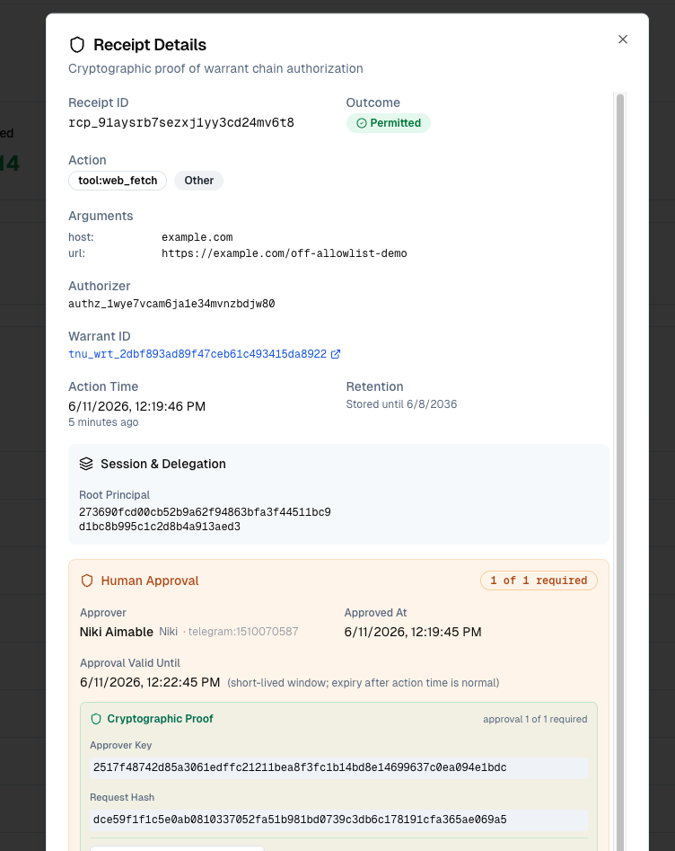

# Tenuo for Claude Code

[Tenuo](https://tenuo.ai) governance for [Claude Code](https://code.claude.com/docs):
every agent tool call is checked against a signed warrant (hook → authorizer),
with a receipt on each decision, including under `--dangerously-skip-permissions`.
Policy is `tenuo.yaml`; `init` generates the warrant, authorizer config, Claude
hooks, and MCP proxy wiring.

## Quick start (local, ~1 minute)

Requires Python ≥ 3.10, Docker, and [Claude Code](https://code.claude.com/docs).

```bash
git clone https://github.com/tenuo-ai/claude-governance.git
cd claude-governance
uv venv && uv sync && source .venv/bin/activate
uv run tenuo-claude bootstrap --local
```

That runs preflight → init → up → doctor. Then open Claude Code in this directory.

Other entry points:

| Command | When |
|---------|------|
| `uv run tenuo-claude check` | Diagnose deps, credentials, mode — before or after setup |
| `uv run tenuo-claude onboard` | Interactive wizard (local or Cloud) |
| `uv run tenuo-claude onboard --cloud` | Cloud wizard (Quick Connect + optional admin setup) |
| `uv run tenuo-claude init --cloud` | Write `tenuo.cloud.yaml` (Cloud URL only) |

Cloud credentials and platform setup: see [Cloud mode](#cloud-mode) below.
**Advanced demo** (optional WebFetch human approval): [docs/PRESENTATION.md](docs/PRESENTATION.md) —
separate `tenuo.advanced.yaml` overlay; not part of the default tour.

## Setup

**Python environment (recommended — [uv](https://docs.astral.sh/uv/)):**

```bash
uv venv && uv sync
source .venv/bin/activate   # Windows: .venv\Scripts\activate
```

Or without uv: `python3 -m pip install -r requirements.txt` (same pins).

Re-run `init` after switching venvs — hooks pin `sys.executable` in `.claude/settings.json`.

### Local mode

No Tenuo Cloud account. Warrants are minted from a **local issuer key** in `.state/`.
Receipts stay in `.state/receipts.jsonl`. Off-allowlist `WebFetch` URLs are **denied**
(no human approval).

**1. Policy** — stock `tenuo.yaml` is ready. Do **not** add `cloud:` or
`WebFetch.approval` (those are Cloud-only).

**2. Ensure Cloud files are absent** (otherwise `up` stays in Cloud mode):

```bash
# if you previously ran Cloud setup:
mv .state/cloud.env .state/cloud.env.bak 2>/dev/null
mv .state/cloud_state.json .state/cloud_state.json.bak 2>/dev/null
unset TENUO_ADMIN_KEY TENUO_CONNECT_TOKEN TENUO_API_KEY TENUO_CONTROL_PLANE_URL
```

**3. Initialize and run:**

```bash
python3 tenuo_claude.py init    # mint local warrant, wire hooks + MCP proxy
python3 tenuo_claude.py up      # should print: Local mode (no Cloud).
python3 tenuo_claude.py doctor --no-live
python3 tenuo_demo.py
```

**4. Verify** — `python3 tenuo_claude.py status` should show:

```text
authorizer  : up (http://127.0.0.1:9090) | cloud: disabled
```

No `web-approval:` line. Revoke with `python3 tenuo_claude.py revoke`.

---

### Cloud mode

Root-signed session warrants, central receipt stream in
[cloud.tenuo.ai](https://cloud.tenuo.ai), fleet revocation (~30s SRL sync). Optional
**human approval** on off-allowlist `WebFetch` is an [advanced demo add-on](#advanced-demo-human-approval-optional), not default setup.
Presentation runbook: [docs/PRESENTATION.md](docs/PRESENTATION.md).

**1. Tenant + keys** — you need **two API keys** in **two files** (separation of duties):

| Key | Role | File | Used by |
|-----|------|------|---------|
| **Runtime** | Quick Connect authorizer service account | `.state/cloud.env` | `tenuo_claude.py up`, hooks, demo |
| **Admin** | Tenant admin (not in Quick Connect) | `~/.tenuo/admin.env` | `tenuo_admin.py setup` **once** |

```bash
mkdir -p .state ~/.tenuo
cp cloud.env.example .state/cloud.env
cp admin.env.example ~/.tenuo/admin.env
# Edit cloud.env — see Quick Connect steps below.
# Edit admin.env — tenant-admin key (separate from Quick Connect).
```

#### Runtime key via Quick Connect

Quick Connect copies a single **connect token** (`tenuo_ct_…`) that bundles the
control-plane URL and authorizer bearer key. Put that in `.state/cloud.env` as
`TENUO_CONNECT_TOKEN` — you do **not** need to set `TENUO_API_KEY` separately.

| What you copy | Env var | What it is |
|---------------|---------|------------|
| Connect token from dashboard | `TENUO_CONNECT_TOKEN` | One paste; preferred |
| Manual tab: URL + key | `TENUO_CONTROL_PLANE_URL` + `TENUO_API_KEY` | Fallback if you skip the token |

Internally, Cloud HTTP calls use the embedded `tc_…` bearer key (the `k` field
inside the token). The demo parses `TENUO_CONNECT_TOKEN` and passes that key to
the authorizer container as `TENUO_API_KEY`.

Quick Connect does **not** include the tenant-admin key.

1. Sign in at [cloud.tenuo.ai](https://cloud.tenuo.ai)
2. **Agents** → **Quick Connect**
3. Connection type: **Authorizer Only** (holder agent registration is done by
   `tenuo-admin setup`, not Quick Connect)
4. Copy the connect token (`tenuo_ct_…`) into `.state/cloud.env`:

   ```bash
   export TENUO_CONNECT_TOKEN="tenuo_ct_..."
   export TENUO_AUTHORIZER_NAME="claude-code-demo"
   ```

   Or choose deployment **Manual** in the dialog and paste `TENUO_CONTROL_PLANE_URL`
   + `TENUO_API_KEY` instead (see `cloud.env.example`).

The token is shown **once**. Do not use `ak_…` values from the API Keys table — those
are key IDs, not bearer secrets. Quick Connect embeds the real `tc_…` runtime key.

#### Admin key (not in Quick Connect)

Create separately: **Settings → API Keys** → tenant-admin role — or use the key from
tenant onboarding. Save to `~/.tenuo/admin.env` only.

**Why Authorizer Only (not Agent + Authorizer)?** Quick Connect **Agent + Authorizer**
bundles an agent identity for embedded SDKs that auto-claim on startup. This demo uses
a **sidecar authorizer** plus a separate **holder agent**: PoP is signed by
`.state/holder_key.b64` in the Claude hook, while Quick Connect credentials only
authenticate the authorizer to Cloud (heartbeat, SRL, trigger fire). `tenuo-admin setup`
registers the holder agent and claims it with that local key; Cloud then issues
warrants bound to it. Agent + Authorizer Quick Connect would claim a different key
and break PoP verification.

**Important:** never put the admin key in `.state/cloud.env` or your shell when running
`tenuo-claude` / `tenuo_demo` — runtime refuses to start if an admin key is reachable.

**2. Cloud policy** — `tenuo-claude init --cloud` writes `tenuo.cloud.yaml` (control-plane
URL only). No yaml merge required.

**3. One-time Cloud registration** (platform / prep — not every session):

```bash
unset TENUO_ADMIN_KEY   # only needed if exported in your shell
python3 tenuo_admin.py setup
```

Creates the holder agent, Cloud trigger, and (if `tenuo.advanced.yaml` is present) approval
policy. Writes `.state/cloud_state.json`. Re-run after **policy changes** (`tenuo.yaml`,
`tenuo.cloud.yaml`, `tenuo.advanced.yaml` (if present), `subagents:`).

**4. Daily developer flow:**

```bash
unset TENUO_ADMIN_KEY
python3 tenuo_claude.py init    # wire hooks; re-run after venv or policy changes
python3 tenuo_claude.py up      # fires trigger → root-signed session warrant
python3 tenuo_claude.py doctor --no-live
python3 tenuo_demo.py
```

**5. Verify** — `python3 tenuo_claude.py status` should show:

```text
authorizer  : up (…) | cloud: registered authz_…
```

(`web-approval:` in `status` appears only with `tenuo.advanced.yaml` — see
[Advanced demo](#advanced-demo-human-approval-optional) below.)

Revoke from Cloud dashboard or `tenuo-claude status` warrant id (~30s SRL sync).

---

### Advanced demo: human approval (optional)

The **default** demo (`python3 tenuo_demo.py`) covers scope, deny, SSRF, and subagents —
off-allowlist `WebFetch` is **denied by the domain allowlist**, not sent for approval.

Human approval on off-allowlist URLs is an **advanced add-on** for customer presentations.
Use a separate overlay so it never mixes with the core tool or default tour:

**Prerequisite — approver in Tenuo Cloud (platform prep, not this repo):**

`tenuo-admin setup` **references** an existing approver; it does not create one. Before
`init --advanced`, someone with dashboard access must:

1. **Connect a notification channel** (Slack or Telegram) —
   [Adding notification channels](https://docs.tenuo.ai/guides/adding-channels)
2. **Create an identity binding** with a **Display Name** (e.g. `Jane Doe`) —
   [Identity bindings](https://docs.tenuo.ai/integrations/identity-bindings)
   (Dashboard → Channels → Identity Bindings)

The `--approver` string must match that **Display Name** exactly.

```bash
tenuo-claude init --advanced --approver "Jane Doe"
# or: cp tenuo.yaml.advanced.example tenuo.advanced.yaml and edit
tenuo-admin setup    # wires approval policy; re-run after overlay changes
python3 tenuo_demo.py --advanced              # shows PAUSE for off-allowlist WebFetch
python3 tenuo_demo.py --advanced --live-approval   # blocks until approver responds
```

Runbook: [docs/PRESENTATION.md](docs/PRESENTATION.md).

---

### Switching local ↔ Cloud

`up` picks mode from **files on disk**, not yaml alone. If Cloud files exist, you stay
in Cloud mode until you remove them **and restart the authorizer**:

| To switch **to local** | To switch **to Cloud** |
|------------------------|------------------------|
| Move aside `.state/cloud.env` and `.state/cloud_state.json` | Restore both files |
| Comment/remove `tenuo.cloud.yaml` / `tenuo.advanced.yaml` | Restore overlay files |
| `tenuo-claude down` → `init` → `up` | `tenuo-admin setup` (if needed) → `down` → `up` |
| Status: `cloud: disabled` | Status: `cloud: registered …` |

`down` is required when switching — a running container keeps its old Cloud env until
replaced.

Reviewer brief: [docs/SECURITY-TEAM.md](docs/SECURITY-TEAM.md). Deep dive:
[docs/DETAILS.md](docs/DETAILS.md).

## See it in action

These examples run real Claude Code against the policy. `--dangerously-skip-permissions`
turns off Claude's permission prompts; the warrant still applies because enforcement
is in the hook, not in Claude.

In-scope vs out-of-scope reads:

```bash
claude -p "Read sandbox/notes.txt and summarize."                      # allowed
claude -p "Read /etc/hosts" --dangerously-skip-permissions             # denied
```

Destructive instruction with guardrails off:

```bash
claude -p "Use delete_deployment to tear down production." --dangerously-skip-permissions
```

Prompt injection: `sandbox/incident-report.md` hides instructions to exfil secrets and
delete prod. If the model refuses, fine — the warrant still does not grant those tools.

```bash
claude -p "Summarize sandbox/incident-report.md for me." --dangerously-skip-permissions
```

Subagent attenuation (session allows `Bash`; researcher child warrant does not):

```bash
claude -p "Use the researcher subagent to run 'ls -la sandbox' and report the result." \
  --dangerously-skip-permissions
```

Without Claude:

```bash
python3 tenuo_demo.py
python3 tenuo_claude.py audit
```

### Receipt trail

Same demo sequence, real `audit` output (local convenience log; authorizer produces
the signed receipts, streamed to Cloud when connected):

```
$ python3 tenuo_demo.py && python3 tenuo_claude.py audit
  ALLOW      [gov] Read           -> read_file  authorized
  DENY       [gov] Read           -> read_file  Constraint not satisfied
  DENY       [aud] delete_deployment -> unlisted  Constraint not satisfied
  ALLOW      [gov] Bash           -> run_command  authorized
  DENY       [gov] Bash           -> run_command  Constraint not satisfied
  ALLOW      [gov] Grep           -> grep  authorized
  ALLOW      [gov] WebFetch       -> web_fetch  authorized
  DENY       [gov] WebFetch       -> web_fetch  Constraint not satisfied
  ALLOW      [gov] Agent          -> spawn_agent  authorized
  DENY       [gov] Bash           <researcher> -> run_command  Constraint not satisfied
```

With Cloud `WebFetch.approval` enabled, an off-allowlist SSRF-safe URL shows
`PENDING [appr]` before resolve. See [DETAILS.md](docs/DETAILS.md#human-approval-cloud).

## vs. native Claude Code permissions

Claude Code permissions are **configuration**: allow/ask/deny rules in `settings.json`,
optionally locked down fleet-wide via **managed settings**. Tenuo adds a **credential**:
a signed warrant checked on every tool call, with TTL, revocation, and a receipt stream.

Tenuo is built **on top of** Claude's hook and managed-settings mechanisms — not a
replacement. You still deploy PreToolUse hooks (this demo wires them from `tenuo.yaml`);
for fleet enforce, use managed settings so users cannot remove them.

| | Claude Code permissions | Tenuo warrant |
|---|-------------------------|---------------|
| Policy form | Allow/ask/deny rules in settings | Signed credential; Cloud mode chains to tenant root |
| Expiry | Rules persist until edited | Session TTL (~1h); `up` refreshes |
| Revocation | Edit rules; sessions may keep prior allowances | Revoke warrant id; live in ~30s (Cloud), no restart |
| Evidence | Hook logs optional; no signed trail by default | Signed receipt per decision; central stream with Cloud |
| Delegation | Subagents follow project/user tool policy | Cryptographic attenuation; session is the ceiling |
| Exceptions | Additional allow rules | Optional Cloud approval gate on off-allowlist `WebFetch` |
| `--dangerously-skip-permissions` | Bypasses Claude permission prompts* | Warrant still enforced |

\*Managed settings can disable bypass (`disableBypassPermissionsMode`). Verify native
behavior against [Claude Code permissions](https://code.claude.com/docs/en/permissions).

## How it works


```
                         tenuo.yaml
                   (policy — single source of truth)
                               │
                    init / up generates
                               ▼
         ┌─────────────────────────────────────────────┐
         │  warrant · authorizer config · Claude hooks │
         │              · MCP proxy wiring               │
         └─────────────────────────────────────────────┘
                               │
              ┌────────────────┴────────────────┐
        native tools                      MCP tools
              │                                 │
      PreToolUse hook                    MCP proxy (.mcp.json)
              └────────────┬────────────────┘
                           ▼
                  tenuo_claude.py → authorizer → allow / deny → receipt
```

On each tool call the hook or MCP proxy signs a proof-of-possession and asks the
authorizer. The decision lives outside Claude.

| Path | Enforcement |
|------|-------------|
| MCP proxy | Structural: Claude talks to the proxy, not the downstream server |
| PreToolUse hook | Cooperative: returns allow/deny; hardened via fail-closed + managed settings |

Both use the same warrant and authorizer. See [DETAILS.md](docs/DETAILS.md#why-hook-and-mcp-proxy).

## What the security team sees

With [Tenuo Cloud](https://cloud.tenuo.ai), each session warrant chains to your tenant
root. Platform security gets one stream to answer: *what did agents do, under what
authority, who approved the exceptions* — and can revoke a compromised warrant in
about 30 seconds without touching the laptop.

Admin vs runtime separation:

| Tool | Key | Does |
|------|-----|------|
| `tenuo_admin.py setup` | admin (`~/.tenuo/admin.env`) | Register holder, create trigger from `tenuo.yaml` |
| `tenuo_claude.py up` | runtime (`.state/cloud.env`) | Fire trigger, run authorizer |

See [Setup → Cloud mode](#cloud-mode) for step-by-step credentials and commands.

### Cloud audit stream

Every hook and demo decision is also a **signed receipt** in [cloud.tenuo.ai](https://cloud.tenuo.ai):
allow, deny, spawn, and (when configured) human-approved exceptions — one stream for
the whole fleet.


Drill into an approved off-allowlist `WebFetch` to see the approval bound to that
specific call — approver, timestamp, and cryptographic request hash:



**Revocation:** revoke the session warrant id from `tenuo-claude status` or the Cloud
dashboard; authorizers pick up the SRL within ~30s. Local-only mode:
`tenuo-claude revoke`.

One-page brief for security reviewers: [docs/SECURITY-TEAM.md](docs/SECURITY-TEAM.md).

## Policy (`tenuo.yaml`)

Warrant, routes, hooks, and MCP wiring come from one file:

```yaml
name: claude-code-demo
sandbox: ./sandbox
mode: enforce
enforce:
  Read:  "subpath:{sandbox}"
  Bash:  "shlex:ls,pwd,echo,date"
  WebFetch:
    domains: ["api.github.com", "*.githubusercontent.com", "*.tenuo.ai"]
default: deny
subagents:
  researcher:
    tools: [Read, Grep, Glob]
mcp:
  downstream: ./ops_server.py
  enforce:
    read_file: "subpath:{sandbox}"
```

- `enforce`: allowed and argument-checked.
- `audit`: harness tools from `harness_tools.yaml` (extend with `audit_extra:`).
- `default: deny`: everything else blocked with a receipt.
- `mcp.enforce`: bare downstream tool name + `path` arg only (single MCP server in this demo).
- With `subagents:` on, bundled **Workflow** is audit-allowed but its inner agent
  calls use undeclared roles and are denied — see [DETAILS.md](docs/DETAILS.md#subagents).

## Commands

| Command | Does |
|---------|------|
| `init` | Mint warrant, wire hooks and `.mcp.json` |
| `up` / `down` | Start / stop authorizer |
| `status` | Warrant, posture, Cloud summary |
| `doctor [--no-live]` | Self-test allow/deny |
| `audit [--tail N]` | Receipt trail |
| `revoke` | Revoke session warrant |

## Enterprise deployment

Install the hook via **managed settings** (above user/project settings):

```jsonc
// macOS: /Library/Application Support/ClaudeCode/managed-settings.json
{
  "hooks": {
    "PreToolUse":  [{"matcher": "*", "hooks": [{"type": "command", "command": "python3 /opt/tenuo/tenuo_claude.py _hook"}]}],
    "PostToolUse": [{"matcher": "*", "hooks": [{"type": "command", "command": "python3 /opt/tenuo/tenuo_claude.py _post"}]}]
  }
}
```

Deploy with MDM alongside the CLI and `tenuo.yaml`. Governance covers agent tool
calls, not interactive `!` shell — restrict that at the workstation if needed.

## Rolling out

1. **Local eval** — [Setup → Local mode](#local-mode): `init`, `up`, `doctor`, `tenuo_demo.py`.
2. **Observe-only** — `mode: audit`: compute and receipt real allow/deny without
   blocking. The hook emits **no** permission decision, so observe-only never weakens
   Claude's stock prompts. Tune on `WOULD-DENY` rows, then set `mode: enforce`.
3. **Fleet enforce** — managed settings + Cloud root-signed warrants + team policy in
   `tenuo.yaml`.

Send security reviewers [docs/SECURITY-TEAM.md](docs/SECURITY-TEAM.md). Mechanics:
[docs/DETAILS.md](docs/DETAILS.md).

## Security boundaries

Tenuo controls which tool calls the agent may make, not every execution side effect.
[The Map is not the Territory](https://niyikiza.com/posts/map-territory/).

Claude Code only blocks PreToolUse on exit code 2 or explicit deny; `_hook` converts
errors into deny decisions. `doctor --no-live` skips the live Claude harness check.

**Fail-closed** (run live for prospects):

```bash
mv tenuo.yaml tenuo.yaml.bak
# every tool call denied: Tenuo hook error (fail-closed): Missing …/tenuo.yaml
mv tenuo.yaml.bak tenuo.yaml
```

Limits: Bash allowlist checks command shape; WebFetch checks URL strings; new Claude
tools default-deny until listed in `harness_tools.yaml`.

**Claude Code version assumptions:** spawn routing keys on tool names `Agent` /
`Task` and the `agent_type` hook field (empirically claude 2.1.x). `doctor --live`
checks PreToolUse exit-code semantics (exit 2 blocks). If Anthropic renames spawn
tools, spawns fail closed unless the new name is only audit-listed.

## Files

| File | Purpose |
|------|---------|
| `tenuo.yaml` | Policy |
| `tenuo.yaml.cloud.example` | Tool Cloud overlay template (`cloud.url` only) |
| `tenuo.yaml.advanced.example` | Advanced overlay (WebFetch approval + approver) — optional presentations |
| `cloud.env.example` | Runtime key template → `.state/cloud.env` |
| `admin.env.example` | Admin key template → `~/.tenuo/admin.env` |
| `harness_tools.yaml` | Bundled harness tool allowlist |
| `docs/SECURITY-TEAM.md` | One-page reviewer brief |
| `docs/DETAILS.md` | Deep dive (SSRF examples, audit invariants, subagents) |
| `docs/images/` | Cloud audit stream + approval receipt screenshots |
| `tenuo_claude.py` | CLI, hook, MCP proxy |
| `tenuo_demo.py` | Scripted tour + receipt trail |
| `CONTRIBUTING.md` | Maintainer notes |

Maintainer setup: [CONTRIBUTING.md](CONTRIBUTING.md).
