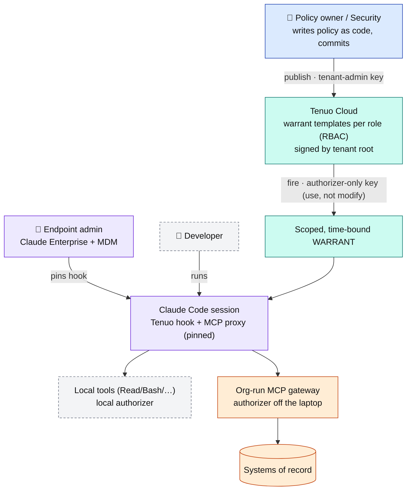
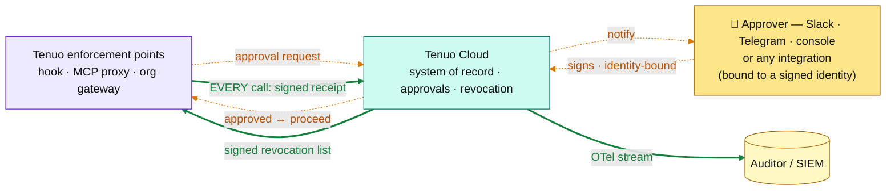

# Enterprise governance: trust model & rollout

Tenuo for Claude Code turns a policy into an enforced, provable boundary on what an agent can do. This doc explains **who controls what**, why the design holds up when the person being governed is also a developer with a laptop, and how an enterprise rolls it out.

## The principle

> **Governance cannot depend on an artifact the governed party controls.**

A `tenuo.yaml` a developer can edit, a hook they can delete, or a `mode` they can flip is a *suggestion*, not a control. So the enterprise model rests on two guarantees:

1. **Authority lives off the endpoint.** What the agent is permitted to do is defined centrally, signed by your tenant root, and delivered as a credential the developer's runtime can *use* but not *modify*.
2. **Enforcement lives where the developer can't disable it** — pinned on managed devices via MDM, and, for the actions that matter most, moved off the laptop entirely to a gateway the org runs.

Everything below is how those two guarantees are assembled from pieces you (and Anthropic, via Claude Enterprise + your MDM) already operate.

## The personas

| Persona | Who | Holds | Authority |
|---|---|---|---|
| **Policy owner** | Security / platform engineering | Tenant-admin key | Authors the **warrant templates** — *what agents may do*. |
| **Endpoint admin** | IT / device management (with Anthropic, via Claude Enterprise) | MDM + Claude Enterprise console | Delivers and **pins** the Tenuo hook via managed settings; forbids bypass mode — *ensures enforcement runs and can't be removed*. |
| **Developer** | Any engineer using Claude Code | Authorizer-only runtime token | Runs the agent. Can *use* a warrant; **cannot author policy, modify it, or disable enforcement** on a managed device. |
| **Approver** | Tech lead / on-call / security | Signed identity binding (Slack / Telegram / console) + signing key | Signs off on approval-gated actions; the signature binds the decision to a person. |
| **Auditor** | Compliance / security ops | Read access to receipts (SIEM) | Consumes the signed audit trail — *proves what happened*. No policy authority. |

> **One org, many policies.** You don't write a single policy — you run **multiple warrant templates**, one per team, environment, or use case (e.g. `backend-prod`: prod writes behind approval; `frontend-sandbox`: no prod, no egress; `data-science`: read-only data access). Tenuo Cloud maps each developer's identity to the right template via **RBAC**, so when a developer fires their trigger they get exactly the policy their role is assigned — no more, no less.

## Who controls what

| Layer | Owned by | What it controls |
|---|---|---|
| **Policy** (what's permitted) | **Security/platform team** → Tenuo Cloud control plane (tenant-admin key) | The warrant template: tools, per-argument constraints, approvals, mode |
| **Credential** (the signed warrant) | **Tenuo Cloud**, signed by your tenant root | Time-bound, scoped, attenuated-on-delegation; runtime key can fire, not modify |
| **Endpoint integrity** (the hook can't be unplugged) | **You + Anthropic** — Claude Code **managed settings** via MDM / Claude Enterprise | Forces the Tenuo PreToolUse hook + proxy; forbids bypass/auto mode |
| **Off-endpoint enforcement** (consequential actions) | **You** — an org-run MCP gateway running the Tenuo authorizer | Access to prod, data, money, internal APIs — enforced server-side |
| **Evidence** (what happened) | **Tenuo Cloud** | Signed, tamper-evident receipts; fleet revocation; SIEM export |
| ~~The local `tenuo.yaml`~~ | Developer | **Nothing authoritative** — a dev-ergonomics projection; the warrant is the source of truth |

The developer controls only the bottom row — and it's been deliberately stripped of authority.

## The trust boundary

Everything that carries authority sits on the org side of a hard line. The developer's side can *use* what it's given and is *recorded* doing so — but it holds no power to change the rules or switch off the controls.

```mermaid
flowchart LR
    subgraph ORG["ORG-CONTROLLED — the developer cannot change this"]
      direction TB
      A1["👤 Policy owner (Security)<br/>authors warrant templates"]:::org
      A2["Tenuo Cloud<br/>signs warrants · RBAC maps role→template<br/>approvals · revocation · signed receipts"]:::tenuo
      A3["👤 Endpoint admin · Claude Enterprise + MDM<br/>pins the Tenuo hook · disables bypass"]:::it
      A4["Org-run MCP gateway<br/>enforces consequential actions off-device"]:::infra
    end
    subgraph DEV["👤 DEVELOPER-CONTROLLED — no authority over governance"]
      direction TB
      B1["Claude Code session"]:::dev
      B2["local tenuo.yaml<br/>(non-authoritative projection)"]:::dev
      B3["authorizer-only runtime token<br/>(fires a warrant · cannot modify policy)"]:::dev
    end
    ORG ==>|"signed warrant + pinned enforcement"| DEV
    DEV -.->|"signed receipts — everything it did"| ORG

    classDef org fill:#dbeafe,stroke:#1e40af,color:#111
    classDef it fill:#ede9fe,stroke:#6d28d9,color:#111
    classDef tenuo fill:#ccfbf1,stroke:#0f766e,color:#111
    classDef dev fill:#f3f4f6,stroke:#6b7280,color:#111,stroke-dasharray:4 3
    classDef infra fill:#ffedd5,stroke:#c2410c,color:#111
    style ORG fill:#f0fdf4,stroke:#15803d
    style DEV fill:#fafafa,stroke:#9ca3af,stroke-dasharray:5 4
```



## The chain of trust

Two views, same colour language: first how an action gets **bounded**, then how it's **proven and controlled**.

### 1 · Issuance & enforcement — bounding the action



### 2 · Approvals & evidence — proving and controlling it



*Edge styles: **amber dashed** = conditional — only for actions that require sign-off (the approval round-trip); **bold green** = always-on — a signed receipt on every call, continuous revocation. Node colours: 🟦 Policy owner/Security · 🟪 Endpoint admin & enforcement points · 🟩 Tenuo Cloud · 🟨 Approver / Auditor.*

> **Accountability is core.** An approval can arrive over Slack, Telegram, the Tenuo Cloud console, or any integration — but it is always **bound to a signed identity**. The receipt records *who* approved, provably, not merely that someone clicked. Same for the agent itself: every action is tied to a signed identity, so the audit trail attributes both the actor and the approver.

### Layer 1 — Policy authority (off the endpoint)

The enforced policy is authored centrally and pushed to Tenuo Cloud with the **tenant-admin key** (CI from a security-owned repo, or the console). It compiles into a **warrant template** the control plane signs with your tenant root. The developer's machine holds only an **"Authorizer-Only" runtime key** that can *fire* the template to mint a session warrant — it **cannot create or modify** templates. Editing the local `tenuo.yaml` does not change what the warrant grants; capability authority is server-side.

### Layer 2 — Endpoint integrity (Claude Code managed settings)

Claude Code resolves settings in a fixed precedence — **Managed > CLI > Local > Project > User** — and **the Managed layer cannot be overridden**. Delivered via MDM (`com.anthropic.claudecode` profile on macOS, Group Policy/Intune on Windows, `/etc/claude-code/` on Linux) or the Claude Enterprise admin console, `managed-settings.json` lets you:

- **Pin the Tenuo PreToolUse hook + MCP proxy** and set `allowManagedHooksOnly: true` so **user/project hooks can't shadow or remove it**.
- **`disableBypassPermissionsMode: "disable"`** and **`disableAutoMode: "disable"`** — forbid `--dangerously-skip-permissions` and auto-accept.
- Optionally `allowManagedMcpServersOnly` / `allowManagedPermissionRulesOnly` to lock the MCP and permission surface to the managed set.

On an MDM-managed device with a non-admin user, the developer cannot unplug Tenuo or downgrade to a bypass mode. (This is a **client-side** control: a user with root on an *unmanaged* device can still tamper with the binary — which is why Layer 3 and Layer 4 exist.)

### Layer 3 — Off-endpoint enforcement (the org-run gateway)

The actions that actually carry risk — production access, customer data, payments, internal APIs — should not be enforced on the machine you're trying to govern. Route them through an **MCP gateway the org operates**, with the Tenuo authorizer inline. The developer can't bypass it because the gateway is infra they don't control and the downstream systems **only accept warrant-bearing, gateway-mediated calls**. Local tools are governed at the hook; systems-of-record access is governed at the gateway. Enforcement of the dangerous calls is off the laptop entirely.

### Layer 4 — Evidence & revocation

Every governed call emits a **signed, tamper-evident receipt** to Tenuo Cloud — the system of record for what each agent did, under whose authority, provable to an auditor. Because the control plane is the registry of which agents exist and what they may do, an agent that acts **without producing receipts stands out against that record** — "no receipt = it didn't happen with our blessing." Pull a policy or revoke an identity and it propagates to every running authorizer in seconds via a signed revocation list. Receipts export to your SIEM (OpenTelemetry-compatible).

## What you already have vs. what Tenuo adds

Tenuo does **not** rebuild device management or Claude Enterprise — it composes with them:

- **You + Anthropic** already operate **MDM + Claude Enterprise managed settings** → that's Layer 2, the non-removable delivery channel.
- **Tenuo** provides the **policy model, the cryptographic warrant, the authorizer (deployable inline at an MCP gateway), and the signed receipts** → Layers 1, 3, 4.

The result is a deployment where security owns the policy, the developer can't quietly change or disable it on a managed device, the consequential actions are enforced off the endpoint, and every action is provable after the fact.

---

## Set it up

**Prerequisites:** a Tenuo Cloud tenant; Claude Enterprise + an MDM/device-management channel; (optional but recommended) an MCP gateway for systems-of-record access.

1. **Author the policies as code.** Keep the org's warrant templates in a security-owned repo, one file per team/use case. In CI, publish each to Tenuo Cloud with the **tenant-admin key** so templates are created/updated centrally and signed by your tenant root. Developers never hold the admin key.

   ```yaml
   # .github/workflows/deploy-agent-policies.yml  (security-owned repo)
   name: deploy-agent-policies
   on:
     push: { branches: [main], paths: ["policies/**"] }
   jobs:
     publish:
       runs-on: ubuntu-latest
       steps:
         - uses: actions/checkout@v4
         - run: pip install tenuo-claude-code
         - name: Publish each policy as a signed warrant template
           env:
             TENUO_ADMIN_KEY: ${{ secrets.TENUO_ADMIN_KEY }}   # tenant-admin, CI secret only
           run: |
             for policy in policies/*.yaml; do          # backend-prod.yaml, frontend-sandbox.yaml, …
               tenuo-admin setup "$policy"               # create/update + sign the template
             done
   ```
   *Illustrative — the exact multi-template publish surface is part of the policy-authoring workstream; today `tenuo-admin setup` operates per project. The shape is what matters: policies reviewed in PRs, published by CI under the admin key, never authored on a developer's machine.*

2. **Provision runtime credentials.** Each developer/machine gets an **Authorizer-Only** runtime token (zero standing privilege — it fires the trigger for a short-lived warrant, can't modify policy).

3. **Pin Tenuo via managed settings.** Through your MDM / Claude Enterprise admin console, deploy `managed-settings.json` that:
   - registers the Tenuo `PreToolUse` hook and the MCP proxy,
   - sets `allowManagedHooksOnly: true`,
   - sets `permissions.disableBypassPermissionsMode: "disable"` and `disableAutoMode: "disable"`.
   ```json
   {
     "hooks": {
       "PreToolUse": [
         {
           "matcher": "*",
           "hooks": [
             { "type": "command", "command": "/opt/tenuo/bin/tenuo-claude _hook", "timeout": 180 }
           ]
         }
       ]
     },
     "allowManagedHooksOnly": true,
     "permissions": {
       "disableBypassPermissionsMode": "disable",
       "disableAutoMode": "disable"
     }
   }
   ```
   The hook `command` is the org-installed Tenuo launcher (`tenuo-claude` ships a fail-closed wrapper, so a missing/again-unreachable launcher *denies* rather than silently allowing). `allowManagedHooksOnly` blocks user/project hooks from shadowing it; the `disable*` flags forbid `--dangerously-skip-permissions` and auto-accept. (JSON, so no comments in the real file.)

4. **Route consequential tools through the gateway.** Point Claude's MCP access at the org-run gateway (Tenuo authorizer inline); ensure downstream systems require gateway-mediated, warrant-bearing calls.

5. **Wire evidence.** Connect Tenuo Cloud receipts to your SIEM over OTel; configure approval routing (Slack/console) for the gray-zone actions; confirm fleet revocation.

6. **Roll out in `dry-run`, then `enforce`.** Ship the policy in observe-only mode first, review the would-deny stream against real usage, then flip to enforce — centrally, for the fleet.

## Honest limits

- Layer 2 is **client-side**: it's robust on MDM-managed, non-admin devices, but a user with root on an unmanaged machine can tamper with the client. Treat managed devices as the boundary, and rely on **Layer 3 (gateway) + Layer 4 (attestation)** for guarantees that don't depend on the endpoint.
- An action boundary bounds **what an agent can do**, not the model's reasoning or honesty. It shrinks blast radius; it doesn't make the agent trustworthy. Run detection alongside it.
