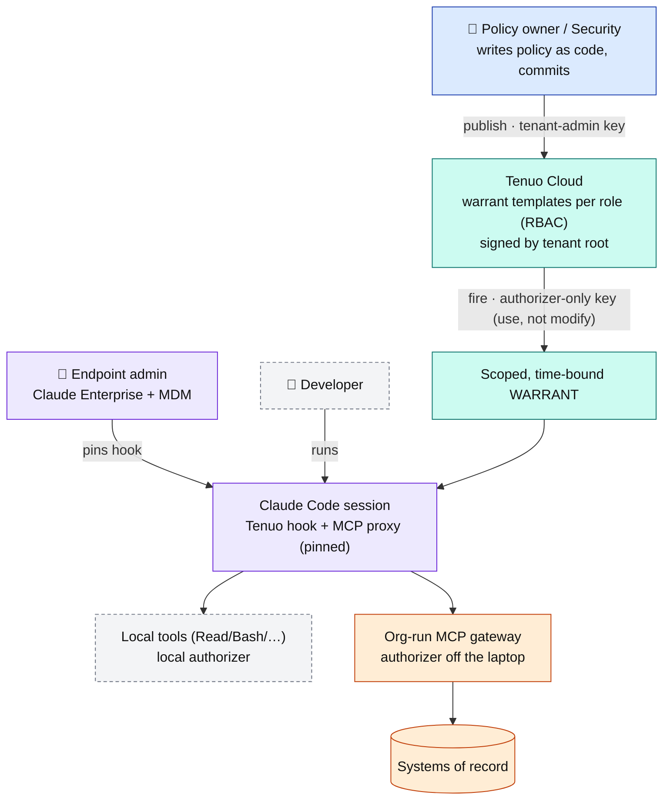

# Enterprise governance: trust model and rollout

Tenuo for Claude Code turns a policy into an enforced, provable boundary on what an agent can do. This doc explains who controls what, why the design holds up when the governed party is also a developer with a laptop, and how an enterprise rolls it out.

## The principle

> Governance cannot depend on an artifact the governed party controls.

A `tenuo.yaml` the developer can edit, a hook they can delete, or a `mode` they can flip only suggests a boundary; it does not enforce one. The enterprise model rests on two guarantees:

1. **Authority lives off the endpoint.** What the agent is permitted to do is defined centrally, signed by your tenant root, and delivered as a credential the developer's runtime can use but not modify.
2. **Enforcement runs where the developer can't disable it.** It is pinned on managed devices via MDM, and for the highest-risk actions it moves off the laptop to a gateway the org runs.

The rest of this doc shows how those two guarantees are assembled from pieces you already operate (and Anthropic, via Claude Enterprise and your MDM).

## The personas

| Persona | Who | Holds | Authority |
|---|---|---|---|
| **Policy owner** | Security / platform engineering | Tenant-admin key | Authors the warrant templates (what agents may do). |
| **Endpoint admin** | IT / device management (with Anthropic, via Claude Enterprise) | MDM + Claude Enterprise console | Delivers and pins the Tenuo hook via managed settings and forbids bypass mode, so enforcement runs and can't be removed. |
| **Developer** | Any engineer using Claude Code | Authorizer-only runtime token | Runs the agent. Can use a warrant, but cannot author policy, modify it, or disable enforcement on a managed device. |
| **Approver** | Tech lead / on-call / security | Signed identity binding (Slack / Telegram / console) + signing key | Signs off on approval-gated actions; the signature binds the decision to a person. |
| **Auditor** | Compliance / security ops | Read access to receipts (SIEM) | Consumes the signed audit trail (proves what happened). No policy authority. |

> **One org, many policies.** You don't write a single policy. You run multiple warrant templates, one per team, environment, or use case (for example `backend-prod`: prod writes behind approval; `frontend-sandbox`: no prod, no egress; `data-science`: read-only data access). Tenuo Cloud maps each developer's identity to the right template via RBAC, so firing a trigger yields the policy that role is assigned.

## Who controls what

| Layer | Owned by | What it controls |
|---|---|---|
| **Policy** (what's permitted) | Security/platform team, via the Tenuo Cloud control plane (tenant-admin key) | The warrant template: tools, per-argument constraints, approvals, mode |
| **Credential** (the signed warrant) | Tenuo Cloud, signed by your tenant root | Time-bound, scoped, attenuated on delegation; the runtime key can fire it, not modify it |
| **Endpoint integrity** (the hook can't be unplugged) | You and Anthropic, via Claude Code managed settings (MDM / Claude Enterprise) | Forces the Tenuo PreToolUse hook and proxy; forbids bypass and auto mode |
| **Off-endpoint enforcement** (consequential actions) | You, via an org-run MCP gateway running the Tenuo authorizer | Access to prod, data, money, internal APIs, enforced server-side |
| **Evidence** (what happened) | Tenuo Cloud | Signed, tamper-evident receipts; fleet revocation; SIEM export |
| ~~The local `tenuo.yaml`~~ | Developer | Nothing authoritative. A developer-ergonomics projection; the warrant is the source of truth |

The developer controls only the bottom row, which has been deliberately stripped of authority.

## The trust boundary

Everything that carries authority sits on the org side of the line. The developer's side can use what it's given, and is recorded doing so, but has no power to change the rules or switch off the controls.

```mermaid
flowchart LR
    subgraph ORG["ORG-CONTROLLED: the developer cannot change this"]
      direction TB
      A1["👤 Policy owner (Security)<br/>authors warrant templates"]:::org
      A2["Tenuo Cloud<br/>signs warrants · RBAC maps role→template<br/>approvals · revocation · signed receipts"]:::tenuo
      A3["👤 Endpoint admin · Claude Enterprise + MDM<br/>pins the Tenuo hook · disables bypass"]:::it
      A4["Org-run MCP gateway<br/>enforces consequential actions off-device"]:::infra
    end
    subgraph DEV["👤 DEVELOPER-CONTROLLED: no authority over governance"]
      direction TB
      B1["Claude Code session"]:::dev
      B2["local tenuo.yaml<br/>(non-authoritative projection)"]:::dev
      B3["authorizer-only runtime token<br/>(fires a warrant · cannot modify policy)"]:::dev
    end
    ORG ==>|"signed warrant + pinned enforcement"| DEV
    DEV -.->|"signed receipts · everything it did"| ORG

    classDef org fill:#dbeafe,stroke:#1e40af,color:#111
    classDef it fill:#ede9fe,stroke:#6d28d9,color:#111
    classDef tenuo fill:#ccfbf1,stroke:#0f766e,color:#111
    classDef dev fill:#f3f4f6,stroke:#6b7280,color:#111,stroke-dasharray:4 3
    classDef infra fill:#ffedd5,stroke:#c2410c,color:#111
    style ORG fill:#f0fdf4,stroke:#15803d
    style DEV fill:#fafafa,stroke:#9ca3af,stroke-dasharray:5 4
```



## The chain of trust

Two views: first how an action is bounded, then how it is proven and controlled.

### 1 · Issuance and enforcement: bounding the action



### 2 · Approvals and evidence: proving and controlling it


*Edge styles: amber dashed = conditional, used only for actions that require sign-off (the approval round-trip); bold green = always-on, a signed receipt on every call plus continuous revocation. Node colors: 🟦 Policy owner/Security; 🟪 Endpoint admin and enforcement points; 🟩 Tenuo Cloud; 🟨 Approver/Auditor.*

> **Accountability is core.** An approval can arrive over Slack, Telegram, the Tenuo Cloud console, or any integration, but it is always bound to a signed identity. The receipt records who approved, tied to a verifiable identity rather than a click. The agent is treated the same way: every action is tied to a signed identity, so the audit trail attributes both the actor and the approver.

### Layer 1: Policy authority (off the endpoint)

The enforced policy is authored centrally and pushed to Tenuo Cloud with the tenant-admin key (CI from a security-owned repo, or the console). It compiles into a warrant template the control plane signs with your tenant root. The developer's machine holds only an Authorizer-Only runtime key. That key can fire the template to mint a session warrant, but cannot create or modify templates. Editing the local `tenuo.yaml` does not change what the warrant grants; capability authority is server-side.

### Layer 2: Endpoint integrity (Claude Code managed settings)

Claude Code resolves settings in a fixed precedence (Managed > CLI > Local > Project > User), and the Managed layer cannot be overridden. Delivered via MDM (`com.anthropic.claudecode` profile on macOS, Group Policy/Intune on Windows, `/etc/claude-code/managed-settings.json` on Linux) or the Claude Enterprise admin console, `managed-settings.json` lets you:

- Pin the Tenuo PreToolUse hook and MCP proxy, and set `allowManagedHooksOnly: true` so user and project hooks can't shadow or remove it.
- Set `permissions.disableBypassPermissionsMode: "disable"` and `permissions.disableAutoMode: "disable"` to forbid `--dangerously-skip-permissions` and auto-accept.
- Optionally set `allowManagedMcpServersOnly` / `allowManagedPermissionRulesOnly` to lock the MCP and permission surface to the managed set.

On an MDM-managed device with a non-admin user, the developer cannot unplug Tenuo or downgrade to a bypass mode. This is a client-side control: a user with root on an unmanaged device can still tamper with the binary, which is why Layers 3 and 4 exist.

### Layer 3: Off-endpoint enforcement (the org-run gateway)

The actions that carry real risk (production access, customer data, payments, internal APIs) should not be enforced on the machine you are trying to govern. Route them through an MCP gateway the org operates, with the Tenuo authorizer inline. The developer can't bypass it because the gateway is infrastructure they don't control and the downstream systems only accept warrant-bearing, gateway-mediated calls. Local tools are governed at the hook; systems-of-record access is governed at the gateway. Enforcement of the consequential calls is off the laptop entirely.

### Layer 4: Evidence and revocation

Every governed call emits a signed, tamper-evident receipt to Tenuo Cloud, the system of record for what each agent did and under whose authority. Because the control plane is the registry of which agents exist and what they may do, an agent that acts without producing receipts is visible against that record. Revoke a policy or an identity and it propagates to every running authorizer within seconds via a signed revocation list. Receipts export to your SIEM (OpenTelemetry-compatible).

## What you already have vs. what Tenuo adds

Tenuo does not rebuild device management or Claude Enterprise; it composes with them:

- You and Anthropic already operate MDM and Claude Enterprise managed settings. That is Layer 2, the non-removable delivery channel.
- Tenuo provides the policy model, the cryptographic warrant, the authorizer (deployable inline at an MCP gateway), and the signed receipts. Those are Layers 1, 3, and 4.

The result is a deployment where security owns the policy, the developer can't quietly change or disable it on a managed device, the consequential actions are enforced off the endpoint, and every action is provable after the fact.

---

## Set it up

**Prerequisites:** a Tenuo Cloud tenant; Claude Enterprise and an MDM/device-management channel; optionally an MCP gateway for systems-of-record access.

1. **Author the policies as code.** Keep the org's warrant templates in a security-owned repo, one project per team or use case. In CI, publish each to Tenuo Cloud with the tenant-admin key so templates are created and updated centrally and signed by your tenant root. Developers never hold the admin key.

   `tenuo-admin setup` operates on the `tenuo.yaml` in the current directory, so give each team its own project directory and run it from there. (A single multi-template publish surface is part of the policy-authoring workstream; the shape below is what matters: policies reviewed in PRs, published by CI under the admin key, never authored on a developer's machine.)

   ```yaml
   # .github/workflows/deploy-agent-policies.yml  (security-owned repo)
   name: deploy-agent-policies
   on:
     push: { branches: [main], paths: ["policies/**"] }
   jobs:
     publish:
       runs-on: ubuntu-latest
       steps:
         - uses: actions/checkout@v4
         - run: pip install tenuo-claude-code
         - name: Publish each policy as a signed warrant template
           env:
             TENUO_ADMIN_KEY: ${{ secrets.TENUO_ADMIN_KEY }}   # tenant-admin, CI secret only
           run: |
             # policies/backend-prod/tenuo.yaml, policies/frontend-sandbox/tenuo.yaml, …
             for dir in policies/*/; do
               ( cd "$dir" && tenuo-admin setup )   # create/update + sign that template
             done
   ```

2. **Provision runtime credentials.** Each developer or machine gets an Authorizer-Only runtime token (zero standing privilege: it fires the trigger for a short-lived warrant and cannot modify policy).

3. **Pin Tenuo via managed settings.** Generate the pinned artifacts with `tenuo-claude managed-template --platform linux|macos --bin /opt/tenuo/bin/tenuo-claude` (add `--authorizer-bin /opt/tenuo/bin/tenuo-authorizer` for macOS). Through your MDM or Claude Enterprise admin console, deploy `managed-settings.json` and, when `mcp.downstream` is configured, the generated `managed-mcp.json`. The settings register the managed Tenuo `PreToolUse` hook, set `allowManagedHooksOnly: true`, set `allowManagedPermissionRulesOnly: true`, and set `permissions.disableBypassPermissionsMode: "disable"` and `permissions.disableAutoMode: "disable"`.

   Abbreviated shape (use the generated file, because the guarded command contains
   shell quoting and the exact deny JSON):

   ```json
   {
     "hooks": {
       "PreToolUse": [
         {
           "matcher": "*",
           "hooks": [
             { "type": "command",
               "command": "/bin/sh -c 'if [ -x /opt/tenuo/bin/tenuo-claude ]; then exec /opt/tenuo/bin/tenuo-claude _managed-hook; else printf %s \"<deny JSON>\"; exit 2; fi'",
               "timeout": 180 }
             ]
           }
         ]
     },
     "allowManagedHooksOnly": true,
     "allowManagedPermissionRulesOnly": true,
     "permissions": {
       "disableBypassPermissionsMode": "disable",
       "disableAutoMode": "disable"
     }
   }
   ```

   Pin the hook command exactly as `tenuo-claude managed-template` emits it. On POSIX that is the `/bin/sh -c` guard shown above with `_managed-hook`: if the org-installed launcher is missing or not executable, it prints a deny decision and exits 2, so the tool is blocked rather than silently allowed. (Pinning bare `tenuo-claude _hook` loses both the fail-closed launcher guard and the managed posture floor.) `allowManagedHooksOnly` blocks user and project hooks from shadowing it; `allowManagedPermissionRulesOnly` stops local permission rules from loosening policy; the `disable*` flags forbid `--dangerously-skip-permissions` and auto-accept. JSON has no comments, so the deny payload is abbreviated here as `<deny JSON>`.

4. **Route consequential tools through the gateway.** Point Claude's MCP access at the org-run gateway (Tenuo authorizer inline), and ensure downstream systems require gateway-mediated, warrant-bearing calls.

5. **Wire evidence.** Connect Tenuo Cloud receipts to your SIEM over OpenTelemetry, configure approval routing (Slack/console) for the actions that need sign-off, and confirm fleet revocation.

6. **Roll out in `dry-run`, then `enforce`.** Ship the policy in observe-only mode first, review the would-deny stream against real usage, then flip to enforce centrally, for the fleet.

## Limits

- Layer 2 is client-side. It is robust on MDM-managed, non-admin devices, but a user with root on an unmanaged machine can tamper with the client. Treat managed devices as the boundary, and rely on Layer 3 (the gateway) and Layer 4 (evidence and revocation) for guarantees that do not depend on the endpoint.
- An action boundary limits what an agent can do, not the model's reasoning or honesty. It shrinks the blast radius; it does not make the agent trustworthy. Run detection alongside it.
